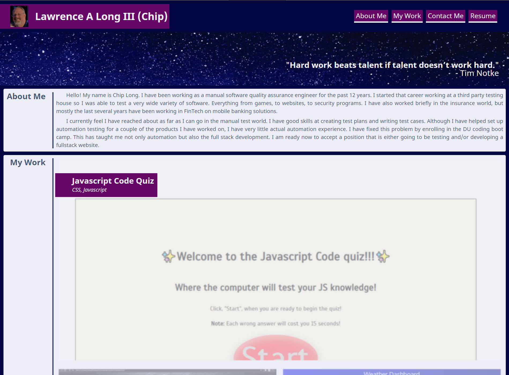

# Chip Long's Portfolio

## Description

A Portfolio will showcase my talents. This will highlight my skills and show my understanding of HTML and CSS. This page, initially, will not be made with JavaScript and will be pure HTML and CSS. This is focusing on using flexbox technology.

This was pretty straight forward. I had already done most of the work already last time so this was just updating the framework.

(see old [README.md](/README-v1.md))

## Table of Contents

- [User Story](#user-story)
- [Acceptance Criteria](#acceptance-criteria)
- [Usage](#usage)
- [Credits](#credits)

## User Story

```
AS AN employer
I WANT to view a potential employee's deployed portfolio of work samples
SO THAT I can review samples of their work and assess whether they're a good candidate for an open position
```

## Acceptance Criteria

- Updated portfolio featuring Project 1 and two exemplary homework assignments.

- Updated GitHub profile with pinned repositories featuring Project 1 and two exemplary assignments.

- Updated resume

- Updated LinkedIn profile

## Usage

Completed site: [https://chip-l.github.io/Portfolio/]



## Credits

Other sources:

- Sekti. (2020, July 27). Fill background animation using css. Retrieved April 18, 2021, from https://dev.to/flyingduck92/creating-fill-background-animation-for-button-using-css-2me3
